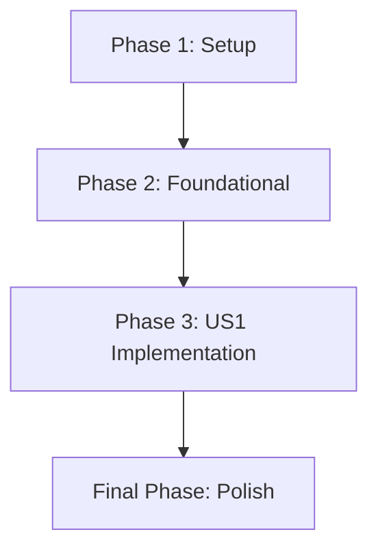

# Tasks: VPC NAT Gateway Cost Estimation

**Feature**: `001-nat-gateway-cost`
**Date**: 2025-12-22
**Implementation Plan**: [plan.md](plan.md)

## Implementation Strategy

We will implement NAT Gateway cost estimation as an incremental addition to the existing AWS public pricing plugin. The strategy involves:
1. **Tooling Update**: Modifying the pricing generator to fetch `AmazonVPC` data.
2. **Foundational Pricing**: Updating the pricing client to parse and index NAT Gateway rates.
3. **Core Logic**: Implementing the estimation logic that handles both fixed hourly and variable data processing costs.
4. **Validation**: Enforcing strict numeric validation for data volume tags as decided in the clarification phase.

## Phase 1: Setup

- [X] T001 Add "AmazonVPC" to `serviceConfig` map in `tools/generate-pricing/main.go`
- [X] T002 Add "AmazonVPC" to default service flag in `tools/generate-pricing/main.go`

## Phase 2: Foundational

- [X] T003 [P] Define `natGatewayPrice` struct in `internal/pricing/types.go`
- [X] T004 Add `NATGatewayPrice` method to `PricingClient` interface in `internal/pricing/client.go`
- [X] T005 [P] Add `rawVPCJSON` embed variable to `internal/pricing/embed_use1.go`
- [X] T006 [P] Add `rawVPCJSON` embed variable to all other regional `internal/pricing/embed_*.go` files
- [X] T007 [P] Add `rawVPCJSON` minimal data to `internal/pricing/embed_fallback.go`
- [X] T008 Implement `parseNATGatewayPricing` method in `internal/pricing/client.go`
- [X] T009 Update `NewClient` to parse `rawVPCJSON` in parallel in `internal/pricing/client.go`

## Phase 3: [US1] Get Accurate NAT Gateway Cost Estimates

**Goal**: Accurately calculate NAT Gateway costs based on hours and data volume.
**Independent Test**: `internal/plugin/projected_test.go` can verify calculations for various tag inputs (valid, missing, invalid).

- [X] T010 [P] [US1] Add NAT Gateway resource type constants in `internal/plugin/projected.go`
- [X] T011 [US1] Update `detectService` function to handle NAT Gateway types in `internal/plugin/projected.go`
- [X] T012 [US1] Implement `estimateNATGateway` method with tag validation in `internal/plugin/projected.go`
- [X] T013 [US1] Add NAT Gateway to switch statement in `GetProjectedCost` in `internal/plugin/projected.go`
- [X] T014 [US1] Update `Supports` method to return true for NAT Gateway in `internal/plugin/supports.go`

## Final Phase: Polish & Cross-cutting Concerns

- [X] T015 [P] Add unit tests for NAT Gateway pricing lookup in `internal/pricing/client_test.go`
- [X] T016 [P] Add unit tests for NAT Gateway estimation logic in `internal/plugin/projected_test.go`
- [X] T017 Add integration tests for NAT Gateway in `internal/plugin/integration_test.go`
- [X] T018 Generate US-East-1 pricing data using `go run ./tools/generate-pricing`
- [X] T019 Verify NAT Gateway cost estimation with manual testing using a sample resource
- [X] T020 [P] Verify regional binary size is < 250MB after adding AmazonVPC data (174MB verified)

## Dependency Graph

## Parallel Execution Examples

### Per User Story (US1)
- `T010` (Constants) can be done while `T014` (Supports) is being prepared.
- `T015` and `T016` (Unit Tests) can be developed in parallel across different packages.
