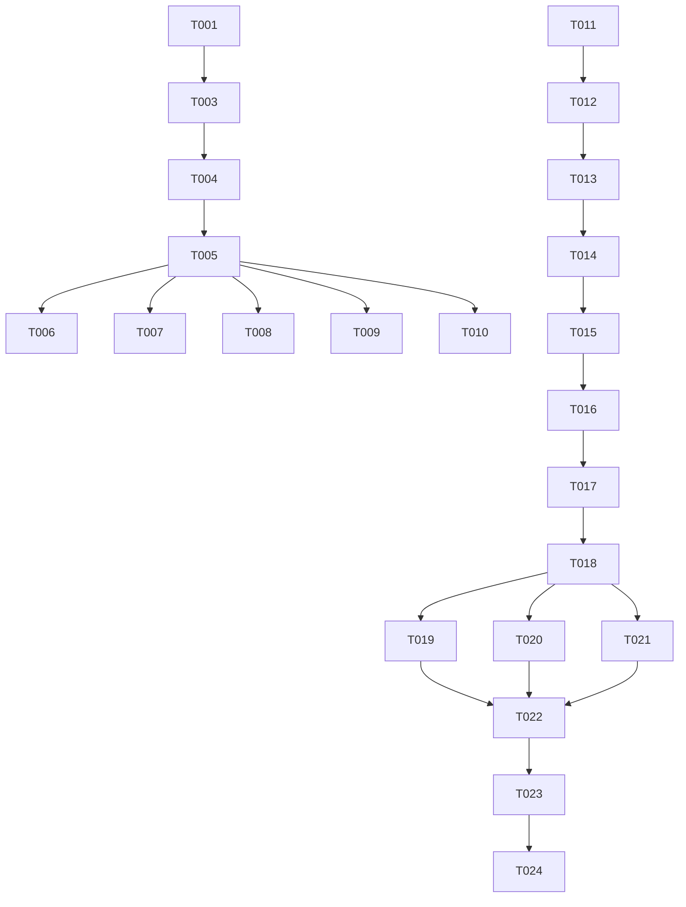

# Tasks: Rename Plugin to FinFocus

**Feature Branch:** `001-rename-plugin-finfocus`
**Status:** Completed
**Plan:** [specs/001-rename-plugin-finfocus/plan.md](plan.md)
**Spec:** [specs/001-rename-plugin-finfocus/spec.md](spec.md)

## Phase 1: Setup

- [x] T001 Verify project readiness and tool availability (tools/generate-pricing, make, etc.)
- [x] T002 Verify `finfocus-spec v0.5.0` is resolvable

## Phase 2: Foundational (Blocking)

*No explicit foundational blocks beyond US1, as dependency migration is the foundation.*

## Phase 3: Core Dependency Migration (User Story 1 - P1)

**Goal:** Update module name, dependencies, and internal imports to `finfocus`.

**Independent Test:** `go mod tidy` succeeds, code compiles with new imports.

### Directory Structure
- [x] T002a [US1] Rename command directory: `git mv cmd/pulumicost-plugin-aws-public cmd/finfocus-plugin-aws-public`

### Dependencies
- [x] T003 [US1] Update `go.mod` module name to `github.com/rshade/finfocus-plugin-aws-public`
- [x] T004 [US1] Update `go.mod` requirement to `github.com/rshade/finfocus-spec v0.5.0`
- [x] T005 [US1] Run `go mod tidy` to resolve new dependencies

### Code Updates
- [x] T006 [P] [US1] Update imports in `internal/plugin/*.go` to use `github.com/rshade/finfocus-plugin-aws-public/...`
- [x] T007 [P] [US1] Update imports in `internal/pricing/*.go` to use `github.com/rshade/finfocus-plugin-aws-public/...`
- [x] T008 [P] [US1] Update imports in `cmd/finfocus-plugin-aws-public/main.go` to use `github.com/rshade/finfocus-plugin-aws-public/...`
- [x] T009 [P] [US1] Update imports in `tools/generate-pricing/main.go` and other tools to use new module path
- [x] T010 [P] [US1] Replace `pulumicost.v1` with `finfocus.v1` in all `*.go` files (proto imports)

### Verification
- [x] T011 [US1] Verify compilation of `cmd/finfocus-plugin-aws-public/main.go`

## Phase 4: Build and Distribution Update (User Story 2 - P2)

**Goal:** Ensure binaries and release artifacts use `finfocus` naming.

**Independent Test:** `make build-region REGION=us-east-1` produces `finfocus-plugin-aws-public-us-east-1`.

### Build Configuration
- [x] T012 [US2] Verify `Makefile` uses `finfocus-plugin-aws-public` for all build targets
- [x] T013 [US2] Verify `.goreleaser.yaml` uses `finfocus-plugin-aws-public` for binary and archive names

### Plugin Registration
- [x] T014 [US2] Update `Name()` in `internal/plugin/plugin.go` to return `finfocus-plugin-aws-public`
  *Note: This updates the stale "aws-public" value mentioned in Constitution Principle III to match the new project identity.*

### Verification
- [x] T015 [US2] Run `make build-region REGION=us-east-1` and verify binary existence and name

## Phase 5: Branding and Documentation (User Story 3 - P3)

**Goal:** Complete the rename in logs, documentation, and historical specs.

**Independent Test:** Grep for "pulumicost" returns 0 matches (excluding legacy env var support).

### Logging & Environment
- [x] T016 [US3] Update log prefixes in `internal/plugin/*.go` to `[finfocus-plugin-aws-public]`
- [x] T017 [US3] Update `internal/plugin/testmode.go` to support `PULUMICOST_TEST_MODE` as deprecated fallback (FR-011)
- [x] T018 [US3] Add `PULUMICOST_` fallback support to `internal/plugin/plugin.go` (MaxBatchSize, StrictValidation) per FR-011

### Documentation & Data
- [x] T019 [P] [US3] Global replace `pulumicost-plugin-aws-public` -> `finfocus-plugin-aws-public` in `README.md`
- [x] T020 [P] [US3] Global replace `pulumicost-plugin-aws-public` -> `finfocus-plugin-aws-public` in `docs/*.md`
- [x] T021 [P] [US3] Global replace `pulumicost` -> `finfocus` (context-aware) in `specs/` directory files
- [x] T021a [P] [US3] Scan and update `testdata/` files for any `pulumicost` references

### Verification
- [x] T022 [US3] Run full test suite `make test`
- [x] T023 [US3] Run `make lint`
- [x] T024 [US3] Scan codebase for remaining `pulumicost` references

## Final Phase: Polish

- [x] T025 Run final consistency check on `go.mod` vs imports
- [x] T026 Verify binary size meets constitution requirements (<250MB)

## Dependencies

## Implementation Strategy

1. **Atomic Rename**: The `go.mod` and import updates should happen in one commit if possible to avoid broken build states.
2. **Verification First**: Verify the build works immediately after the core rename (Phase 3) before moving to docs (Phase 5).
3. **Legacy Support**: Ensure the env var backward compatibility is tested (T017, T018).
4. **Constitution Alignment**: The project is being renamed to `finfocus-plugin-aws-public`. This explicitly overrides the stale Constitution requirement for `Name()` to return "aws-public". We will implement the new name as per the feature specification.